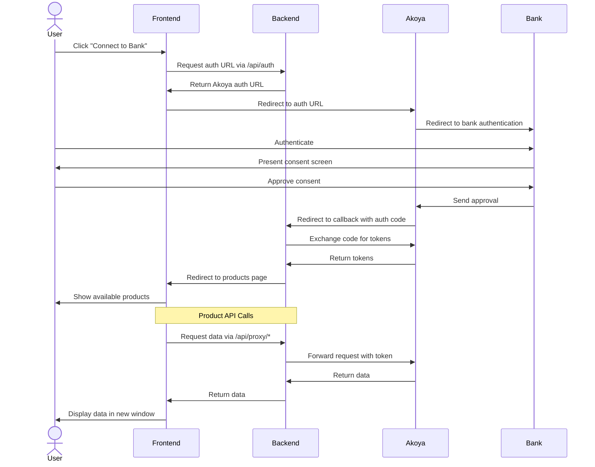

# Akoya API Integration Demo

⚠️ **DEMO/LEARNING PURPOSES ONLY - NOT FOR PRODUCTION USE** ⚠️

A simple Node.js application demonstrating Akoya's API OAuth2 flow and data retrieval capabilities.

## Disclaimer

This is sample code intended for learning and demonstration only. It:
- Is NOT production-ready
- Does NOT represent best practices
- Lacks proper security measures
- Comes with NO support or maintenance
- Should NOT be used as a base for production applications

For production implementations, please:
1. Consult [Akoya's official documentation](https://docs.akoya.com)
2. Implement proper security measures
3. Follow your organization's standards
4. Consider security expert consultation

## Project Structure
```
├── __tests__/              # Test files
│   └── server.test.js      # Server tests
├── test-config/            # Test configuration
│   └── setup.js           # Test setup
├── coverage/              # Test coverage reports (not in repo)
├── public/                # Static files
│   ├── index.html        # OAuth flow page
│   └── products.html     # Data display
├── server.js             # Express server & proxy
├── .env                  # Environment variables (not in repo)
├── .env.test            # Test environment variables
├── .env.example         # Example environment template
├── jest.config.js       # Jest configuration
├── LICENSE.md           # Project license and disclaimers
└── package.json         # Dependencies
```

## Prerequisites
- Node.js (v14+)
- npm
- Akoya Data Recipient Hub account
- Sandbox app credentials from Akoya

## Sandbox App Setup
1. Log into the [Akoya Data Recipient Hub](https://recipient.ddp.akoya.com)
2. Create a new Sandbox application
3. Configure the Redirect URI in your app settings:
   ```
   http://localhost:3000/callback
   ```
   ⚠️ This must exactly match the REDIRECT_URI in your .env file
4. Note your Client ID and Client Secret

## Installation

1. Clone the repository:
```bash
git clone <repository-url>
cd <project-directory>
```

2. Install dependencies:
```bash
npm install
```

3. Set up environment variables:
```bash
cp .env.example .env
```

4. Edit `.env` and add your Akoya credentials:
```
CLIENT_ID=your_akoya_client_id
CLIENT_SECRET=your_akoya_client_secret
REDIRECT_URI=http://localhost:3000/callback
```

## Development

Start the server:
```bash
node server.js
```

The application will be available at `http://localhost:3000`

## Testing

Run tests:
```bash
# Run tests
npm test

# Run tests with coverage
npm run test:coverage

# Run tests in watch mode
npm run test:watch
```

### Coverage Reports
- HTML report: `coverage/lcov-report/index.html`
- Coverage thresholds:
  - Branches: 80%
  - Functions: 80%
  - Lines: 80%
  - Statements: 80%

Test configuration is in:
- `jest.config.js` - Jest settings and coverage configuration
- `test-config/setup.js` - Test environment setup
- `__tests__/*.test.js` - Test files
- `.env.test` - Test environment variables

## OAuth2 Flow
This application implements a standard OAuth2 flow:



## Security Notes
- Never commit `.env` files to the repository
- Keep credentials secure
- Don't expose secrets to frontend
- Ensure Redirect URIs match exactly between app config and .env
- All Akoya API calls should go through the proxy to avoid CORS issues

## License

MIT License - Copyright (c) 2024

See LICENSE.md file for full details and disclaimers.